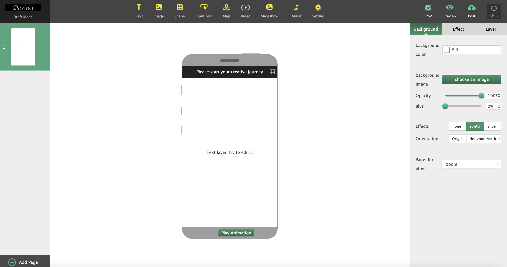

# DaVinci

DaVinci is ECD 2013's 1.0 editor, based on Angluarjs and DOM implementation, the latest version has been reimplemented based on canvas, rust and webgl



# Quick Start

```shell
git clone git@github.com:central-perk/DaVinci.git
npm i
npm start
```

# License

DaVinci is distributed under the terms of MIT license.

See LICENSE for details.
